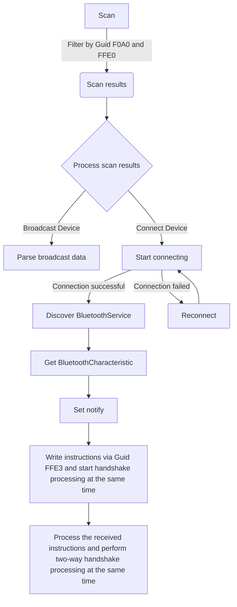

# ailink

##[中文](README_CN.md)

AiLink broadcast scale data decryption and body fat algorithm Flutter library.

## Necessary condition

1. Acquired AILink Bluetooth communication protocol
2. Have smart devices that support AILink Bluetooth module
3. Have knowledge of Flutter development and debugging

## Android

1. Add ```maven { url 'https://jitpack.io' }``` in android/build.gradle file
```
    allprojects {
        repositories {
            google()
            mavenCentral()
            //add
            maven { url 'https://jitpack.io' }
        }
    }
```

2. Modify ```minSdkVersion 21``` in the android/app/build.gradle file
```
    defaultConfig {
        // TODO: Specify your own unique Application ID (https://developer.android.com/studio/build/application-id.html).
        applicationId "com.example.ailink_example"
        // You can update the following values to match your application needs.
        // For more information, see: https://docs.flutter.dev/deployment/android#reviewing-the-gradle-build-configuration.
        minSdkVersion 21 //flutter.minSdkVersion
        targetSdkVersion flutter.targetSdkVersion
        versionCode flutterVersionCode.toInteger()
        versionName flutterVersionName
    }
```

3. To use the flutter_blue_plus library, you need to add the required permissions to android/app/src/main/AndroidManifest.xml
```
    <manifest xmlns:android="http://schemas.android.com/apk/res/android">
        <uses-permission android:name="android.permission.BLUETOOTH" />
        <uses-permission android:name="android.permission.BLUETOOTH_ADMIN" />
        <uses-permission android:name="android.permission.ACCESS_FINE_LOCATION"/>
    <manifest xmlns:android="http://schemas.android.com/apk/res/android">
```

## iOS
1. When using the flutter_blue_plus library, you need to add the required permissions to ios/Runner/Info.plist
```
    <?xml version="1.0" encoding="UTF-8"?>
    <!DOCTYPE plist PUBLIC "-//Apple//DTD PLIST 1.0//EN" "http://www.apple.com/DTDs/PropertyList-1.0.dtd">
    <plist version="1.0">
        <dict>
            <key>NSBluetoothAlwaysUsageDescription</key>
            <string>Need BLE permission</string>
            <key>NSBluetoothPeripheralUsageDescription</key>
            <string>Need BLE permission</string>
            <key>NSLocationAlwaysAndWhenInUseUsageDescription</key>
            <string>Need Location permission</string>
            <key>NSLocationAlwaysUsageDescription</key>
            <string>Need Location permission</string>
            <key>NSLocationWhenInUseUsageDescription</key>
            <string>Need Location permission</string>
        </dict>
    </plist>
```

## Flutter



1. import AiLink plugin
```
    import 'package:ailink/ailink.dart';
```

2. Plug-in initialization
```
    final _ailinkPlugin = Ailink();
```

### Broadcast Data Encryption and Decryption, and Retrieval of Body Fat Data

1. Decrypt data
```
    _ailinkPlugin.decryptBroadcast(Uint8List)
```

2. Get body fat data
```
    _ailinkPlugin.getBodyFatData(ParamBodyFatData().toJson())
```

### Bluetooth Handshake Command Encryption and Decryption

After connecting to the device, two handshakes are required
First call  ```final firstHandShakeData = _ailinkPlugin.initHandShake()``` to obtain handshake instructions
And call ```characteristic.write(firstHandShakeData.toList(), withoutResponse: true)``` to send to the device

After writing, the set handshake instruction ```setHandShakeData``` returned by the device is received.
The second call ```final secondHandShakeData = _ailinkPlugin.getHandShakeEncryptData(Uint8List.fromList(setHandShakeData))```
And call ```characteristic.write(secondHandShakeData.toList(), withoutResponse: true)``` to send to the device
That completes the handshake

1. The app sends this A6 data to actively start handshake with ble, and the return byte[] needs to be sent to ble actively
```
    _ailinkPlugin.initHandShake()
```

2. This method encrypts the A6 data of the ble test app and sends the app to the device, otherwise the device will disconnect the app and return byte[] and need to actively send it to ble
```
    _ailinkPlugin.getHandShakeEncryptData(Uint8List.fromList(data))
```

For specific usage, please see example
