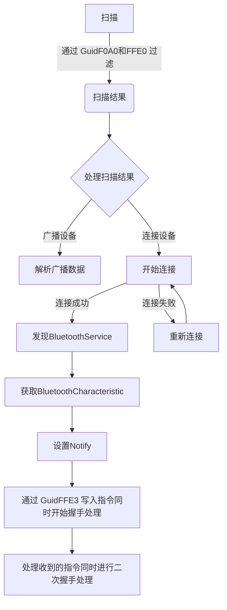

# ailink

##[English](README.md)

AiLink广播数据解密、体脂数据算法和连接设备握手加解密Flutter库.

## 必备条件

1. 已获取AILink蓝牙通讯协议
2. 拥有支持AILink蓝牙模块的智能设备
3. 具备Flutter开发和调试知识

## Android

1. 在android/build.gradle文件中添加```maven { url 'https://jitpack.io' }```
```
    allprojects {
        repositories {
            google()
            mavenCentral()
            //add
            maven { url 'https://jitpack.io' }
        }
    }
```

2. 在android/app/build.gradle文件中设置```minSdkVersion 21```
```
    defaultConfig {
        // TODO: Specify your own unique Application ID (https://developer.android.com/studio/build/application-id.html).
        applicationId "com.example.ailink_example"
        // You can update the following values to match your application needs.
        // For more information, see: https://docs.flutter.dev/deployment/android#reviewing-the-gradle-build-configuration.
        minSdkVersion 21 //flutter.minSdkVersion
        targetSdkVersion flutter.targetSdkVersion
        versionCode flutterVersionCode.toInteger()
        versionName flutterVersionName
    }
```

3. 使用flutter_blue_plus库, 需要在android/app/src/main/AndroidManifest.xml文件中添加相关权限
```
    <manifest xmlns:android="http://schemas.android.com/apk/res/android">
        <uses-permission android:name="android.permission.BLUETOOTH" />
        <uses-permission android:name="android.permission.BLUETOOTH_ADMIN" />
        <uses-permission android:name="android.permission.ACCESS_FINE_LOCATION"/>
    <manifest xmlns:android="http://schemas.android.com/apk/res/android">
```

## iOS
1. 使用flutter_blue_plus库, 需要在ios/Runner/Info.plist文件中添加相关权限
```
    <?xml version="1.0" encoding="UTF-8"?>
    <!DOCTYPE plist PUBLIC "-//Apple//DTD PLIST 1.0//EN" "http://www.apple.com/DTDs/PropertyList-1.0.dtd">
    <plist version="1.0">
        <dict>
            <key>NSBluetoothAlwaysUsageDescription</key>
            <string>Need BLE permission</string>
            <key>NSBluetoothPeripheralUsageDescription</key>
            <string>Need BLE permission</string>
            <key>NSLocationAlwaysAndWhenInUseUsageDescription</key>
            <string>Need Location permission</string>
            <key>NSLocationAlwaysUsageDescription</key>
            <string>Need Location permission</string>
            <key>NSLocationWhenInUseUsageDescription</key>
            <string>Need Location permission</string>
        </dict>
    </plist>
```

## Flutter



1. 导入AiLink插件
```
    import 'package:ailink/ailink.dart';
```

2. 插件初始化
```dart
    final _ailinkPlugin = Ailink();
```

### 广播数据解密和获取体脂数据

1. 解密广播数据
```
    _ailinkPlugin.decryptBroadcast(Uint8List)
```

2. 获取体脂数据
```
    _ailinkPlugin.getBodyFatData(ParamBodyFatData().toJson())
```

### 蓝牙握手加解密

连上设备后需要进行两次握手
第一次调用```final firstHandShakeData = _ailinkPlugin.initHandShake()```获取握手指令
并调用```characteristic.write(firstHandShakeData.toList(), withoutResponse: true)```发送给设备

写入后接收到设备返回的设置握手指令setHandShakeData
第二次调用```final secondHandShakeData = _ailinkPlugin.getHandShakeEncryptData(Uint8List.fromList(setHandShakeData))```
并调用```characteristic.write(secondHandShakeData.toList(), withoutResponse: true)```发送给设备
即完成握手

1. app发送此A6数据主动开始与ble进行握手,返回byte[]需要主动发送给ble
```
    _ailinkPlugin.initHandShake()
```

2. 此方法将ble检验app的A6数据进行加密，app发给设备，否则设备将断开app,返回byte[]需要主动发送给ble
```
    _ailinkPlugin.getHandShakeEncryptData(Uint8List.fromList(data))
```

### 广播数据解析ElinkBleData(cid,vid,pid,mac)
1. 判断设备是广播设备还是连接设备，传入广播数据中获取的uuids
```dart
    final isBroadcastDevice = ElinkBleCommonUtils.isBroadcastDevice(uuids);
```
2. ElinkBroadcastDataUtils中提供了getElinkBleData()方法，传入广播数据即可获取ElinkBleData，因为广播设备和连接设备广播数据不一样，所以需要传入isBroadcastDevice标识。
```dart
  final isBroadcastDevice = ElinkBleCommonUtils.isBroadcastDevice(uuids);
  final elinkBleData = ElinkBroadcastDataUtils.getElinkBleData(manufacturerData, isBroadcastDevice: isBroadcastDevice);
```

### Elink A7数据加解密
1. 加密，传入elinkBleData.macArr、cidArr和要解密的数据payload
```dart
    final _alink = Ailink();
    final encrypted = await _alink.mcuEncrypt(Uint8List.fromList(elinkbleData.cidArr), Uint8List.fromList(elinkBleData.macArr), Uint8List.fromList(payload));
```
2. 解密，传入elinkBleData.macArr和要加密的数据data
```dart
    final _alink = Ailink();
    final decrypted = await _alink.mcuDecrypt(Uint8List.fromList(elinkBleData.macArr), Uint8List.fromList());
```

### 连接设备协议命令处理
1. ElinkCmdUtils中提供了getElinkA6Data和getElinkA7Data方法获取A6和A7协议指令
```dart
    import 'package:ailink/utils/elink_cmd_utils.dart';
    final a6Data = ElinkCmdUtils.getElinkA6Data(payload);
    final a7Data = ElinkCmdUtils.getElinkA7Data(cid, _mac, payload);
```
2. ElinkCmdUtils中还提供了一些常用字节操作方法


具体使用方法，请参照示例
